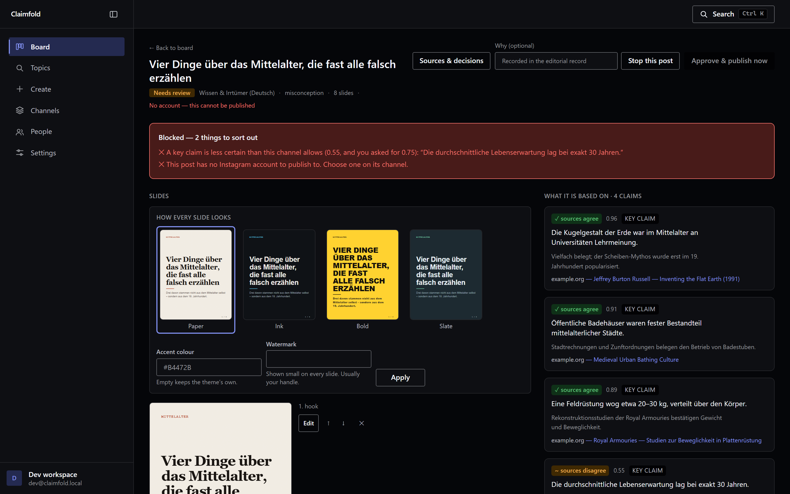
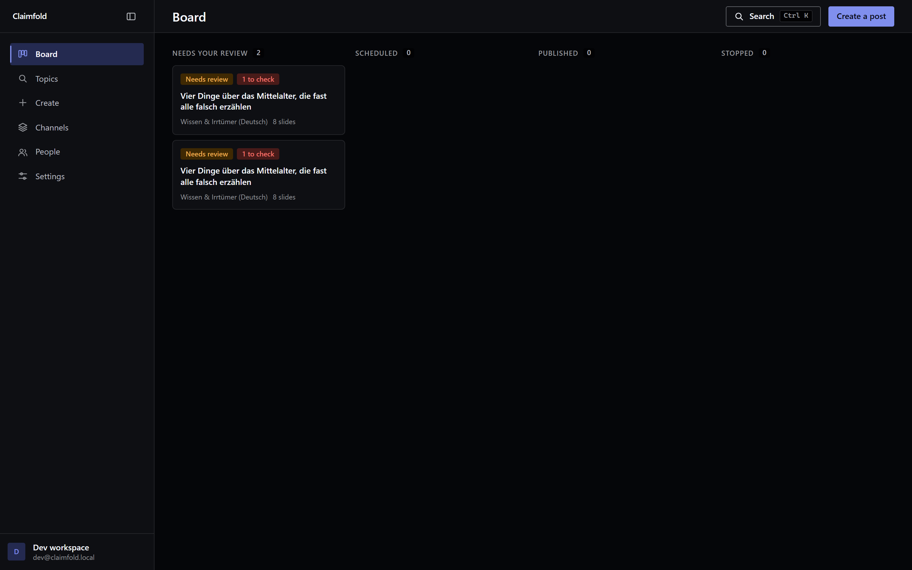
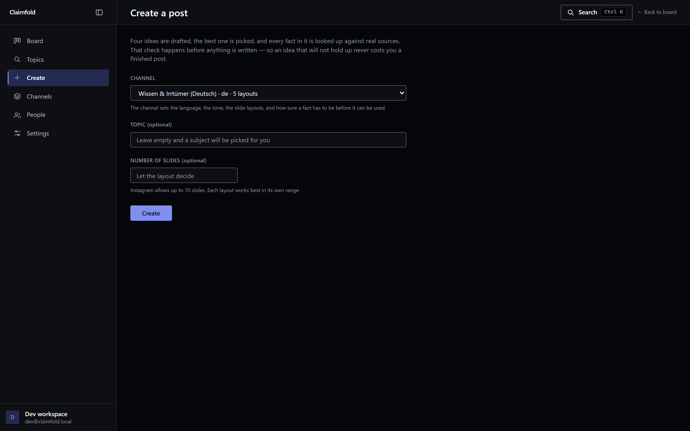
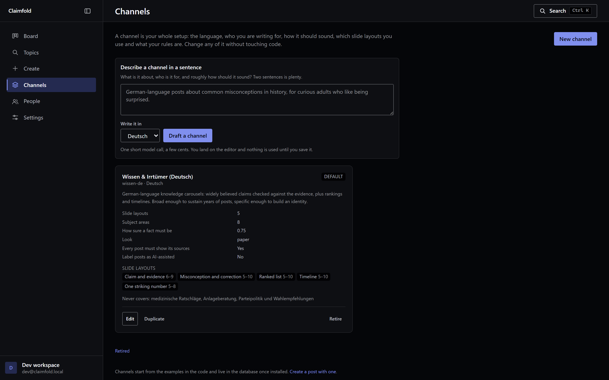
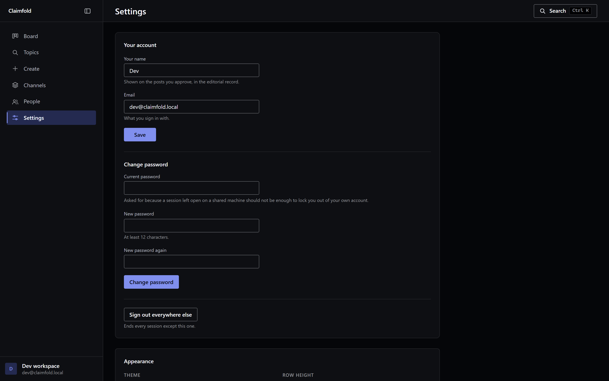
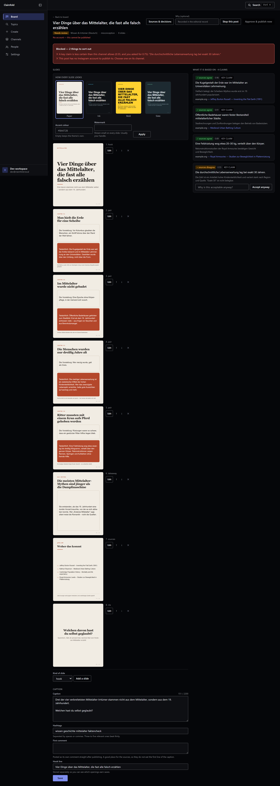

# Claimfold

Self-hosted studio for researching, sourcing, editing, reviewing and publishing
Instagram carousels.

Not a slop generator. Every factual claim is researched against web sources and
recorded with its verdict, confidence and citations — and nothing publishes
without a named human approving it.

[](https://github.com/Naxter/claimfold/actions/workflows/ci.yml)
[](LICENSE)
[](package.json)



*Above: a post that will not publish, for two separate reasons. One of its four
claims came back at 0.55 confidence against a floor of 0.75, and no Instagram
account has been chosen on the channel. Both have to be cleared by a person —
the claim by fixing it or accepting it in writing under a name, the account by
picking one — before approving does anything.*

<details>
<summary>The rest of the dashboard</summary>

The board, where posts wait for a decision:



Starting a run, and what a run costs:



A channel: language, voice, allowed slide formats, confidence floor:



Connecting an Instagram account through your own Meta app:



And the review screen in full, all eight slides and the caption editor:



</details>

> **On wording.** This tool does not certify that anything is true. It
> *researches* claims, *cites* what it found, and *blocks* publication until a
> person takes editorial responsibility. Deliberately not described as
> "fact-checked", "verified" or "accurate": under German law those are
> quality characteristics you can be held to (§ 434 BGB, § 5a UWG), and the
> honest description is also the more defensible one.

**Status: in development.** The pipeline runs end to end — generate, verify,
gate, write, edit, review, schedule — and posts are measured after they go out.
Publishing has not yet been exercised against a live Instagram account. Before
using a real account, run the [Instagram live canary](docs/runbooks/instagram-live-canary.md)
against a dedicated test account. See `docs/devlog/` for the build log.

---

## What it does

```
idea → verify → GATE → write → EDIT → REVIEW → schedule → publish → measure
                 ↑                      ↑
       refuses before it writes  you are here, always
```

The gate runs *before* the writing stage, not after. Writing a full carousel
around claims that will be rejected wastes the tokens and, worse, produces a
polished draft that is tempting to wave through.

- **Topic-agnostic.** The subject, language, voice, slide formats and editorial
  rules are runtime configuration, not code. Run a German history channel and an
  English science channel from one install, and change either without a deploy.
- **Sourced and gated.** A dedicated verification stage searches the web,
  records a verdict, confidence and citations for every claim, and blocks
  publication when a core claim doesn't hold up. Overriding a verdict requires a
  written reason and is attributed to the person who did it.
- **Editable.** Every word and every visual choice can be changed before
  approval — see [Editing](#editing) below. Copy edits are recorded against the
  person who made them and surfaced to whoever approves.
- **An exportable record per post.** Claims, verdicts, confidences, sources,
  every override with the name of the person who made it, the approver, which
  account it went out on, and every page the verifier opened. Readable at
  `/posts/{id}/record`, printable to PDF, downloadable as JSON or CSV.

  This is also what makes the AI Act workable. From 2 August 2026, Art. 50(4)
  requires deployers publishing AI-generated text on matters of public interest
  to disclose it — *unless* the content underwent substantive human review with
  a named person holding editorial responsibility. That is not self-certifying;
  it is something you have to be able to show. This is the showing.
- **Multi-tenant, properly.** Tenant isolation is enforced by Postgres
  row-level security, not by remembering a `WHERE` clause.
- **Static carousels only.** No video, no Reels.

## Requirements

- Node 22+
- An API key for **one** model provider — [OpenAI](https://platform.openai.com/api-keys)
  (the default) or [Anthropic](https://console.anthropic.com/settings/keys).
  Set `LLM_PROVIDER` to choose; no model name appears anywhere in the pipeline,
  so switching is one line in `.env`.
- An Instagram **Professional** (Business or Creator) account
- Your own Meta developer app — takes about ten minutes, and it is what keeps
  every install on Standard Access, so **no App Review is ever required**
- Docker, for production. Not needed for development.

## Quick start (development)

```bash
npm install
npx playwright install chromium

cp .env.example .env         # then generate the two keys it asks for
npm run db:migrate           # embedded Postgres, nothing to install
npm run db:seed              # an account, a channel, and one post to review

npm run render:demo          # fixture JSON → 8 JPEGs in ./out
npm run dev                  # dashboard on http://localhost:3100
```

The six OFL fonts are committed, so a fresh clone renders correctly offline.
`npm run fonts:fetch` re-downloads them if you ever need to.

`render:demo` needs no database, no API key and no network. If the files in
`./out` look good, the rendering half of the product works.

With the dashboard running, **Generate** runs the whole pipeline — four
candidate ideas, verification against live sources, the gate, then writing.
Roughly a minute, and about $0.43 a post at current model prices — the number
the pipeline actually records on each run, which you can read under **Recent**
on the Create page. If the gate refuses the idea, nothing gets written and you
land on a rejected post showing which claim failed and what was searched.

If the dev server is ever killed rather than stopped, the embedded database can
come back unreadable — PGlite is Postgres compiled to WebAssembly and does not
replay a broken write log. `npm run db:reset` moves it aside and rebuilds.
Production runs real Postgres and is unaffected. Only ever run one process
against the embedded database at a time; two is the way it gets corrupted.

## Channels

A **channel** is the entire editorial setup for one Instagram account, stored as
data rather than code: the language, who you are writing for, how it should
sound, which slide layouts are allowed, the subjects to draw from, the
confidence floor the gate enforces, and the account it publishes to.

Three ways to get one:

- **Describe it in a sentence.** One short model call turns "German-language
  posts about common misconceptions in history, for curious adults" into a full
  configuration, and drops you in the editor to read it before anything uses it.
- **Start blank**, or **duplicate** an existing one — the practical way to run an
  English twin of a German channel without retyping a voice description.
- Three starter packs ship in `packages/niches`. `npm run db:seed` installs the
  first one; the other two are available to the "describe it" and "duplicate"
  routes above but are not seeded automatically.

Every field goes through the same validation the gate uses, so an unusable
channel cannot be saved. Two settings deliberately cannot be argued down: the
confidence floor has a hard minimum of 0.5, and there is no prompt override for
the verification stage — a channel must not be able to tell it what to conclude.

Retiring a channel hides it without deleting anything; the posts it produced
keep their record.

### Which account a post goes to

The account belongs to the channel, not the post, because a channel already owns
the handle and the posting schedule. Choosing a channel is therefore choosing an
account, and the watermark and the destination can never name different handles.
The account is copied onto each post when it is created, so repointing a channel
later does not rewrite where past posts went. A single-account workspace is
never asked. Reasoning in
[`docs/decisions/0004`](docs/decisions/0004-which-account-a-post-goes-to.md).

## Editing

Everything a post says and how it looks can be changed on the review screen,
before approval:

| | |
|---|---|
| **Words** | Slide copy, alt text, caption, hashtags, the hook line, and the first comment |
| **Look** | Theme, brand accent colour, watermark, and a per-slide layout override |
| **Pictures** | Upload a photo onto a slide, or reuse one already uploaded |
| **Structure** | Reorder, add and delete slides |

Which fields appear depends on the layout, driven by a map that a test checks
against the templates themselves — so a box you can type into is always a box
that changes the slide.

Two things follow from the product's own thesis. **A copy edit is recorded**
against the person who made it, and raises a warning on the review screen,
because claims are attached to slides and rewriting a slide leaves sources that
were read against different words. Changing a colour or a layout touches no
claim and raises nothing. And **text never sits directly on a photograph** — it
sits on a wash of the theme colour, because contrast over an arbitrary image
cannot be measured the way a colour pair can.

Uploaded pictures are decoded and re-encoded before they are stored, which
strips EXIF (routinely carrying the GPS coordinates of the room) and discards
anything in the file that is not pixels.

## Roles

Members hold one of four roles, enforced in every server action rather than by
hiding buttons:

| Role | |
|---|---|
| `owner`, `admin` | Everything |
| `editor` | Create and edit; cannot approve, reject, override a verdict or change the destination account |
| `viewer` | Read only |

An unrecognised role gets read-only. Not knowing the rules is not the same as
there being none.

## Measuring

The worker polls Instagram insights for published posts a few times a day, for
their first thirty days, and stores one row per post per day. Saves and shares
lead the display; likes are collected because they are cheap, not because they
should drive a decision.

## Adding a model provider

Two backends ship, and a third is an addition rather than a rewrite. The
pipeline never names a vendor, a model or a message format: it asks for
structured data against a Zod schema, and for research with sources attached.

1. Write a class satisfying `LlmProvider` in `packages/content/src/llm/`. It is
   two methods — `generate` for a schema-shaped answer, `research` for the same
   with the pages it consulted. `openai.ts` is the longer reference; `anthropic.ts`
   is the shorter one.
2. Add it to `ProviderId` and to `FACTORIES` in `packages/content/src/llm/index.ts`.
3. Document its variables in `.env.example`.

Nothing in the pipeline changes, and no stage learns the name. Two constraints
the interface enforces on purpose: every call is single-shot, so no stage can be
steered by something it read earlier, and the only tool any stage may use is web
search inside `research()`. Both exist because the verifier reads pages that may
be written to manipulate it — see
[`docs/decisions/0001`](docs/decisions/0001-security-posture.md).

One honest caveat, which the code states too: that a backend *runs* and that it
is *trustworthy for this job* are different claims. The verification stage
decides whether a factual claim reaches an audience, so a new backend deserves
its own evaluation before it is offered to operators.

## Production

```bash
cp .env.example .env         # then set ENCRYPTION_KEY and AUTH_SECRET
docker compose up -d
```

Postgres starts, a one-shot `migrate` service builds the schema and applies the
row-level-security policies, and only then do the web app and the worker come
up. The worker owns the publish queue, because Instagram's API has no scheduling
of its own.

`ENCRYPTION_KEY` and `AUTH_SECRET` have no defaults on purpose — compose refuses
to start without them rather than booting on a placeholder. `.env.example`
carries the one-line command that generates each.

Behind a reverse proxy that terminates TLS, set `TRUST_PROXY=true`. Without it
an `http://` `APP_URL` in production is refused at startup, because the
alternative is session cookies quietly shipping without the `Secure` flag.

## Backups

```bash
npm run backup
```

Writes `backups/<timestamp>/` containing a database dump and a copy of the
storage directory. Pass a path to put it somewhere that is not this disk:
`npm run backup -- /mnt/nas`.

Two things cannot be regenerated and both are in there: the database (posts, the
claims that justify them, the encrypted Instagram tokens) and `storage/`
(rendered slides and uploaded pictures). Renders can in principle be rebuilt;
uploads cannot, so a published post whose picture is gone stays gone.

`ENCRYPTION_KEY` is deliberately **not** in the backup. A file containing both
the encrypted tokens and the key that opens them is one file that compromises
every connected account — keep the key in a password manager instead. Restoring
without it gives you every post and every channel, and every Instagram account
has to reconnect.

On the Docker install the volumes are named, not anonymous, but
`docker compose down -v` still takes them. That is a normal thing to type.

## Layout

| Path | |
|---|---|
| `apps/web` | Dashboard, review and editing UI, OAuth callbacks |
| `apps/worker` | Publish queue, token refresh, insights polling |
| `packages/db` | Schema, migrations, row-level security |
| `packages/content` | Pipeline stages, prompts, the publication gate |
| `packages/niches` | Channel configuration — formats, rules, presets |
| `packages/templates` | Slide design system, React templates, contrast checks |
| `packages/render` | Chromium → JPEG pipeline, upload normalisation |
| `packages/storage` | Rendered and uploaded images on disk |
| `packages/ig` | Instagram Graph client — OAuth, publishing, insights |
| `packages/trends` | Topic discovery from free public sources |
| `packages/crypto` | Secret encryption, log redaction, licence verification |
| `docs/decisions` | Architecture decision records |
| `docs/devlog` | Build log |

## Testing

```bash
npm test
```

The suite that matters most is `packages/db/src/__tests__/isolation.test.ts`. It
writes deliberately incorrect queries and asserts the database refuses them.

Several others exist because of a specific way something once went wrong, and
each says so at the top: slide reordering must carry claim attribution with it,
a blank form field must not create a permanent render-cache miss, the templates
package must stay importable from a browser, and an uploaded image must come out
without the metadata it went in with.

`npm run typecheck` and `npm run lint` are the other two gates. Linting is
type-aware, which is the point — the bugs it has actually caught here were a
Graph API field stringified into `[object Object]` and stored as an access
token, and form fields read as text when they could be files.

## Security

See [`docs/decisions/0001-security-posture.md`](docs/decisions/0001-security-posture.md)
for the threat model. Three surfaces are unusual for a CRUD app and get specific
treatment: prompt injection via the verifier's search results, SSRF via the
headless rendering browser, and image uploads — the one place the product
accepts a file from a person.

Found something? Please report privately rather than opening an issue.

## Licence

Two different things share the word.

**The source licence** is Business Source License 1.1 — source-available, free
for evaluation and non-production use, converts to an open licence over time.
See `LICENSE`.

**A licence key** is an Ed25519-signed string checked offline, with no network
and nothing phoning home. Set `LICENSE_KEY` in `.env`; leave it blank to run in
evaluation mode. An expired or unreadable key shows a banner and nothing else —
**no feature is gated on the tier yet**, and turning limits on will be a
separate, deliberate change. What is free and why is argued in
[`docs/decisions/0002`](docs/decisions/0002-what-is-free.md).

Issuing keys is vendor-side: `npm run license:keygen` once, then
`npm run license:sign -- --tier solo --to "Acme GmbH"`. The private half is
written to a gitignored file and never belongs in this repository.

## Decisions

| | |
|---|---|
| [0001](docs/decisions/0001-security-posture.md) | Security posture and threat model |
| [0002](docs/decisions/0002-what-is-free.md) | The verification gate is free, forever |
| [0003](docs/decisions/0003-editing-generated-content.md) | Editing a generated post |
| [0004](docs/decisions/0004-which-account-a-post-goes-to.md) | A channel belongs to an account |
| [0005](docs/decisions/0005-what-each-role-may-do.md) | What each role may do |
| [0006](docs/decisions/0006-licence-keys-are-checked-offline.md) | Licence keys are checked offline, and gate nothing yet |
