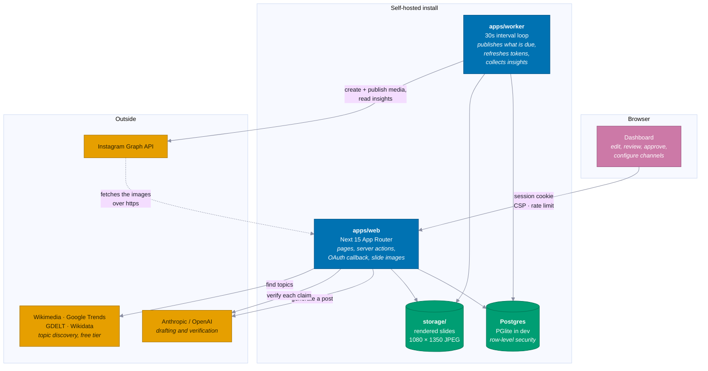
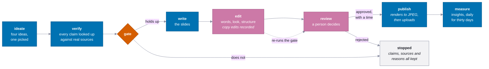
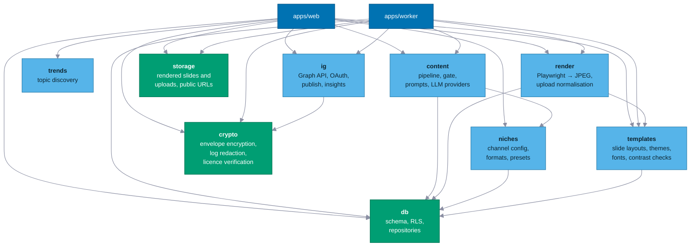
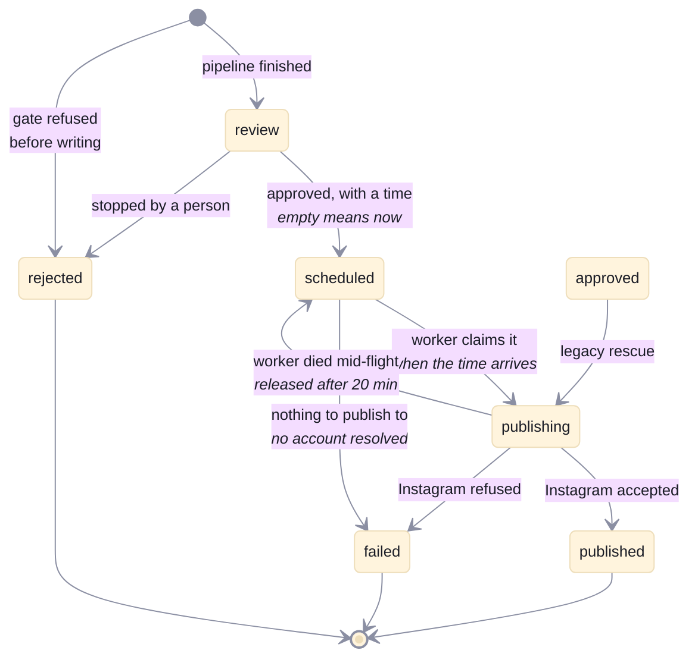
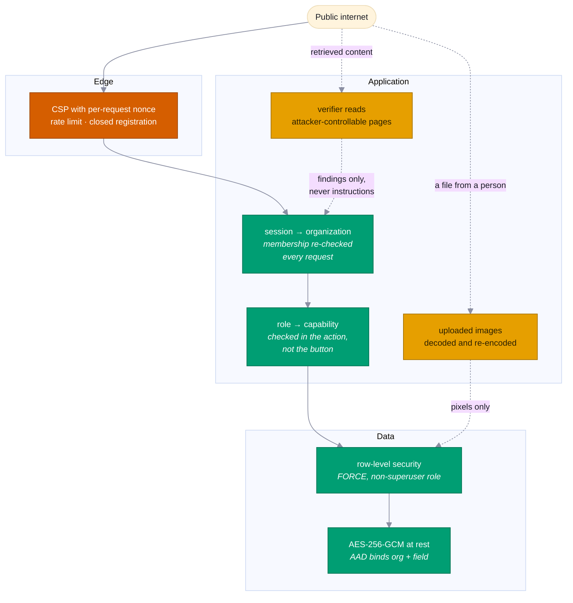

# Architecture

How Claimfold is put together, and why the parts sit where they do.

Colours below come from the project's own `--viz-*` tokens — the Wong
colourblind-safe set declared in `apps/web/app/tokens.css`. Each hue marks a
layer, and the same hue means the same layer in every diagram.

---

## 1. The system

Two processes, one database, and a deliberately small number of things reached
over the network.

**The dotted arrow is the one people miss.** Instagram does not accept an image
upload — it is given a URL and fetches the file itself, server to server. That
is why `APP_URL` has to be publicly reachable over https before anything can be
published, and why `publicUrlIsPublishable()` exists to say so before a run
starts rather than after it fails.

**Why two processes.** Instagram's Content Publishing API has no scheduling, so
"post at 18:00" is the application's problem — something has to be awake at
18:00, which is also why production cannot be a laptop. The worker is a plain
interval loop rather than a job framework: the workload is a handful of posts a
day across a handful of tenants, and a queue broker would be more infrastructure
for a buyer to run and more to go wrong, for no benefit at this scale.

---

## 2. The pipeline

The order is the product. Everything else is plumbing.

**The gate runs before the writing stage, not after.** Writing a full carousel
around claims that will be rejected wastes the tokens and, worse, produces a
polished draft that is tempting to wave through. A post costs about $0.43 to
produce; refusing early is the cheap half of that.

A refused idea is not discarded. The claims, the verdicts, the sources and the
reasons are all saved — that record is the part worth keeping, and it is what
`/posts/{id}/record` prints.

**Rendering happens at publish, not before review.** The review screen draws
slides live in the browser from the same React components the publisher
screenshots, so a reviewer sees the real thing without a headless Chromium in
the web image — and editing a headline does not cost a rasterisation. The
worker renders each slide whose content hash has changed, seconds before
uploading it, because Instagram's media containers expire 24 hours after
creation and pre-building them at schedule time would leave them stale.

**Editing sits between writing and review, and feeds back into the gate.** A
copy edit stamps the slide and raises a warning, because claims are attached to
slides by index and rewriting one leaves sources that were read against
different words. Changing a theme or a layout touches no claim and raises
nothing — see `docs/decisions/0003-editing-generated-content.md`.

**Containment.** The stage that reads the internet and the stage that writes the
post never talk directly. Verification returns structured findings, not prose
for the writer to continue from. That is not tidiness: the verifier reads pages
that may be written to manipulate it, and this is the boundary that stops
retrieved text becoming instructions.

---

## 3. The packages

Nine packages, each owning one thing. The direction of dependency never
reverses, and the arrows below are the ones actually declared in the
`package.json` files.

Two arrows that used to be here were wrong: `templates → niches` (templates
depends only on `db`) and a missing `web → templates`, which the dashboard has
always needed to draw live previews. Both mattered because this diagram is the
thing people check a new import against.

**Two packages have a second entry point, for the same reason.**
`@claimfold/templates/document` keeps `react-dom/server` out of the dashboard's
bundle, and `@claimfold/templates/fonts` keeps `node:fs` out of the browser —
the package root is imported by client components that render slide previews, so
anything reachable from it must work in a browser. `@claimfold/render/image`
does the same for `sharp`, so uploading a photo does not drag Playwright into the
web app. `packages/templates/src/__tests__/browser-safe.test.ts` walks the root's
import graph and fails if a Node builtin becomes reachable.

`packages/trends` is deliberately not reachable from the worker — discovery is
operator-triggered, never scheduled, because it spends a rate limit that belongs
to free public services.

`packages/niches` sits at the bottom of the domain layer because it is the only
thing that knows what a channel *is*. The subject, language, voice, slide
formats and editorial rules are runtime configuration, not code — which is what
lets one install run a German history channel and an English science channel
without a deploy, and what the anti-hardcoding test protects.

---

## 4. A post's life

The states are a database enum and a contract between the web app and the
worker. Only two of them are reachable by a person.

**`approved` is a state nothing new can enter.** It used to be where approving
without a time landed — and the worker only ever selects `scheduled`, so a post
a person had signed off sat in a column called "Approved" that nothing could
take it out of. Every piece worked; the handover between them did not exist.

Approving now always writes `scheduled` with a time, and the worker sweeps up
any `approved` rows left from before. Both halves are held by
`apps/worker/src/__tests__/publish-schedule.test.ts`, which is deliberately
placed *between* the two components rather than inside either — the gap was
invisible precisely because both sides passed their own tests.

**`scheduled → failed` is the second version of the same lesson.** `publishPost`
used to return a failure it could not recover from *without writing anything*, so
the post stayed `scheduled`, `findDuePosts` handed it back on the next tick, and
it ran every thirty seconds forever — nothing published, nothing failed, nothing
said why. Combined with `posts.igAccountId` being read by the worker and written
by nothing, that meant every scheduled post in the product looped silently.

Both halves are fixed: a channel now carries the account and stamps it onto each
post (`docs/decisions/0004-which-account-a-post-goes-to.md`), and a terminal
refusal is persisted as one. The gate also blocks approval when no account
resolves, so the failure is now caught before a person signs the post off rather
than after. The rule the loop broke is worth stating on its own: **a refusal that
is not written down is a refusal that repeats forever.**

---

## 5. Trust boundaries

Where the interesting failures would be.

**Row-level security is the tenant boundary, not a `WHERE` clause.** Application
scoping fails open — forget it once and a customer sees another customer's data.
RLS fails closed: forget it and the query returns nothing. For software sold to
people whose Instagram accounts must never touch, that difference is the whole
thing.

Two details make it real rather than decorative: `FORCE ROW LEVEL SECURITY`,
because without it the table owner bypasses policies and the owner is exactly
who the app connects as; and a non-superuser role, because superusers bypass RLS
even with FORCE.

**Secrets are bound to their row.** Access tokens and per-organization app
secrets are encrypted with AAD that includes the org and the field, so copying
one tenant's encrypted token into another tenant's row produces a decryption
failure rather than a working token.

**An uploaded image is never stored as it arrived.** It is decoded with sharp and
re-encoded as JPEG, which discards everything in the file that is not pixels.
That kills polyglot files — an image with an archive or a script appended, which
matters because these are served from the one unauthenticated route in the
product — and it strips EXIF, which routinely carries the GPS coordinates of the
room the photo was taken in. Publishing somebody's home address as a side effect
of adding a picture is not a mistake that can be walked back.

**Roles are enforced in the server action, never by hiding a button.** A greyed
control is a courtesy to the person using the app; a server action is a public
endpoint. An unrecognised role resolves to read-only, for the same reason the
gate refuses a channel it cannot validate: not knowing the rules is not the same
as there being none. See `docs/decisions/0005-what-each-role-may-do.md`.

**Prompt injection is contained, not solved.** It should be revisited whenever
the pipeline gains a capability that lets a later stage act on retrieved text
without a person in between.

See `docs/decisions/0001-security-posture.md` for the full posture and what is
still open, and `0005` and `0006` for the permission model and licence
verification.

---

## 6. Local versus production

The same migrations and the same code, two drivers.

| | Development | Production |
|---|---|---|
| Database | PGlite — embedded Postgres compiled to WASM, in `data/dev` | Postgres in Docker or on a VPS |
| Driver | `drizzle-orm/pglite` | `drizzle-orm/postgres-js` |
| Worker | started separately, usually not at all | runs beside the web container |
| Slide images | `storage/` on disk | `storage/` on a volume, served over https |

PGlite is genuine Postgres rather than a shim, so row-level security, enums and
`jsonb` behave identically. That is what lets `npm run dev` work on a laptop
with nothing installed while production runs the same migrations.

**One operating rule.** PGlite is single-connection: two instances over one
directory corrupt it, and the corruption is delayed by about twenty minutes, so
the damage never looks like it came from what caused it. The instance is cached
on `globalThis` to survive Next's hot reload, and no `tsx` script that touches
`data/dev` may run while the dev server is up.
